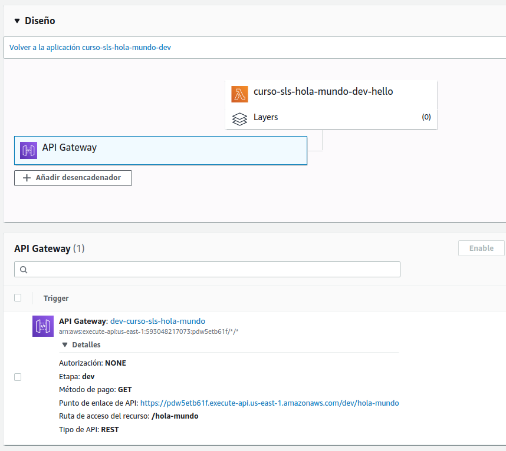
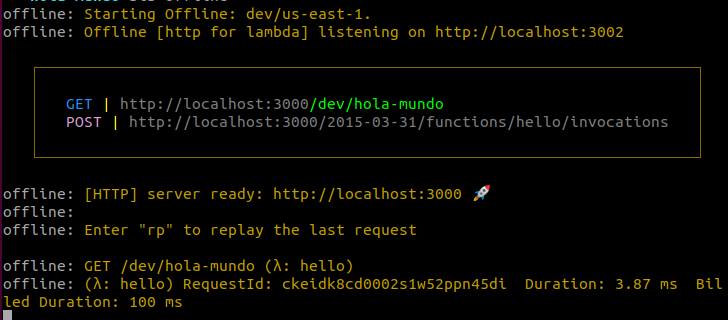

# Hola Mundo Serverless

1. [Instalar serverless](#serverless)
2. [Hola mundo](#new)
3. [Endopoint con API Gateway](#apigateway)
4. [Desarrollar en modo offline para evitar gastos en AWS](#offline)
5. [Pasar y recoger parámetros en modo de segmento por la url](#params)
6. [Añadimos otra función a nuestro handler.js](#post)
7. [Eliminar proyecto de AWS](#remove)

## 1. Instalar Serverless y configuración inicial

Para instalar serverless 

`sudo npm install -g serverless`
 
Creamos unas nuevas credenciales en nuestra cuenta de AWS y copiamos la key y el secret para utilizarlo en la configuración del servicio 
 
`serverless config credentials --provider aws --key <key> --secret <secret>`

## 2. Nuevo proyecto

Creamos el proyecto estableciendo el proveedor y el lenguaje en el template y le damos un nombre 

`serverless create --template aws-nodejs --name curso-sls-hola-mundo`

Esto nos genera dos archivos **handler.js**  con la función que vamos a desarrollar:
 
~~~
module.exports.hello = async event => {
  return { 
    statusCode: 200, 
    body: JSON.stringify(
      {
        message: 'Go Serverless v1.O! Your function executed successfully!,
        input: event, 
      },
      null,
      2
    )
  };
}
~~~

y  **serverless.yml** con los parámetros de configuración.

Para desplegar el proyecto en nuestra cuenta de AWS utilizaremos el siguiente comando: 

`sls deploy`

Si únicamente queremos desplegar una función en concreto (caso de proyecto con muchas funciones) 
 
`sls deploy –f nombreFuncion –s entorno(dev, pro...)`
 
Para ejecutar la función en remoto: 

`sls invoke -f nombreFuncion -s entorno(dev, pro...)`

Si queremos ejecutarla en local añadimos el parámetro *local* después de *invoke*

A esta invocación podemos pasarle parámetros de esta forma 

`sls invoke local -f hello -s dev -d '{"name": "Abel Alonso"}'`

El parámetro llega a la función en la variable *event*

## 3. Endpoint con API Gateway

En el archivo **serverless.yaml** añadimos dentro de la función el evento desencadenador: 

~~~
functions:
  hello:
    handler: handler.hello 
    events: 
      - http: 
          path: hols-mundo
          method: get
~~~

   ***Mucho ojo con la tabulación entre http y path***

Volvemos a desplegar y el cambio relizado en serverless.yaml hará que en la lamda se genere un desencadenador de api gateway de forma automática. Podemos comprobar que esto funciona entrando en la URL que se genera al hacer el deploy. 

En la consola de AWS podemos comprobar que efectivamente se ha creado un trigger para el get a esa url 

## 4. Desarrollar en modo offline para evitar gastos en AWS

Iniciamos el proyecto de node 

`npm  init –y`

Instalamos la libreria serverless offline 

`npm  install serverless-offline`

Añadimos el plugin al archivo de configuración serverless.yaml 

~~~
service: 
  curso-sls-hola-mundo 
plugins: 
  - serverless-offline 
~~~

De esta forma ya podemos ejecutar la función en local y hacer pruebas: 

`sls offline`

Este comando levantará un servidor local con nuestra función: 

## 5. Pasar y recoger parámetros en modo de segmento por la url

Podemos pasar parámetros de segmento de la siguiente forma: 

1. .Editamos la ruta en el archivo **serverless.yaml**

~~~
functions:
  hello:
    handler: handler.hello
    events:
      - http: 
          path: hola-mundo/{name} 
          method: get 
~~~

2. Modificamos la función en el archivo **handler.js** para utilizar éste parámetro

~~~
module.exports.hello = async event => {
  return { 
    statusCode: 200, 
    body: JSON.stringify(
      {
        message: 'Hola S{event.pathParameters.name}!,
      },
      input: event
      null,
      2
    )
  };
};
~~~

## 6. Peticiones POST y parsear datos con Querystring

Añadimos otra función a nuestro **handler.js**

~~~
module.exports.showUser = async event => {
  return {
    statusCode: 200,
    body: JSON.stringify(
      {
        message: 'petición post',
        input: event['body'],
      }, 
      null,
      2
    ) 
  };
};
~~~

Configuramos esta nueva ruta en **serverless.yaml**

~~~
functions:
  hello:
    handler: handler.hello
    events:
      - http:
          path: hola-mundo/{name}
          method: get 
  showUser: 
    handler: handler.showUser 
    events: 
      - http: 
          path: user 
          method: post
~~~

Para trabajar de forma más limpia con los datos que llegan en el body, instalamos la librería querystring 

`npm  install querystring`

Incluimos la librería en **handler.js**

~~~
const queryString = require('querystring')
~~~

Y modificamos la función para aplicar la librería al body que nos viene en la llamada 

~~~
module.exports.showUser = async event => { 
  const body queryString 'body']) ; 
  return {
    statusCode: 200,
    body: JSON.stringify(
      {
        message: 'petici6n post',
        input: 'Hola ${body.name} '${body.surname}`
      },
      null, 
      2
    )
  };
};
~~~

## 7. Eliminar proyecto de AWS 

Para eliminar lo desplegado en AWS simplemente debemos ejecutar 

`sls remove`